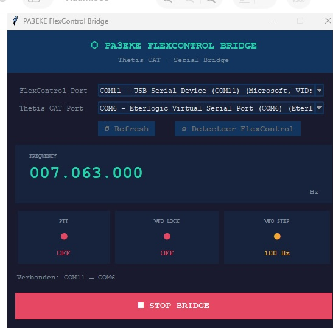

# PA3EKE FlexControl Bridge

**PA3EKE FlexControl Bridge** is a Windows GUI application that connects a **FlexControl** tuning knob to **Thetis and SDR Console** through a CAT serial COM port. It emulates the Kenwood protocol.

The application allows you to select COM ports, detect the FlexControl, start a serial bridge, and control frequency tuning, step size, PTT, and VFO lock.

*FlexControl Bridge running with active FlexControl and Thetis CAT serial connections.*

---

## Features

- Windows desktop GUI
- COM port selection
- FlexControl detection
- Frequency display
- Step size switching
- PTT control
- VFO Lock control
- Stores previously selected COM ports

---

## Requirements

- Windows 10 or Windows 11
- A working **FlexControl**
- A working **Thetis CAT** serial port
- The Windows `.exe` does **not** require Python to be installed

---

## Installation

Download the Windows executable from the GitHub **Releases** section.
